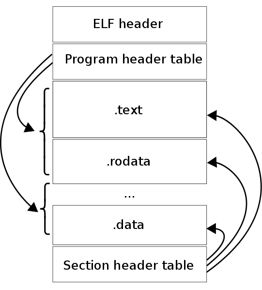

It is a common standard file format for executable files, relocatable code (object ie .o files), shared libraries, and core dumps. It is a spec of ABI (Application Binary interface). By design it is flexible, extensible, cross-platform, CPU architecture & ISA independent. It can be loaded at any memory address by the kernel and automatically, all symbols used, are adjusted to the offset from that memory address where it was loaded into.

**File name extensions :** none, .axf, .bin, .elf, .o, .prx, .puff, .ko, .mod and .so

**Magic Number :** 0x7F ‘E’ ‘L’ ‘F’

 Image Source : Wikipedia

- Program header table : zero or more memory _segments_. Only appears at executable. It tells how the executable should be put into the process virtual memory (How to create a process image). This is must for process image, executable files and shared objects. For Relocatable object files, this is not needed.
- Section header table : zero or more _sections_. Tells how or where section should be loaded. Each section entry in table contains section name and section size. Section Header Table must for the files used in link editing.
- Data : of program header table or section header table.
- ELF header (52 or 64 byte long for 32 or 64 bit) : defines whether to use 32 or 64 bits.
- Program header : Tells how to create process image.

_Sections_ are smallest indivisible units in ELF file that can be processed. (Linking view). Sections hold the bulk of object file information for the linking view. This data includes instructions, data, symbol table, and relocation information.

_Segments_ are smallest individual units that can be mapped to memory by exec or linker. (Executable view)

Section vs Segment : In an object file section exists before linking, while segment exists after linking in executable file. Linker puts one or more sections into a single segment.

Sections and segments have no specified order in ELF. Only the ELF header has a fixed position in the file.

**Tools :**

- [readelf](https://linux.die.net/man/1/readelf) : gives info about ELF files. (from GNU binutils).
- [elfutils](https://sourceware.org/elfutils/) : alternative to binutils.
- [elfdump](http://elfdump.sourceforge.net/) : dumps ELF information of an ELF file.
- [objdump](https://linux.die.net/man/1/objdump) : gives info of obj files. It uses the Binary File Descriptor library as a back-end to structure the ELF data.
- [file](https://linux.die.net/man/1/file) : can display some information about ELF files, including ISA for which the code in a relocatable, executable, or shared object file is intended, or on which an ELF core dump was produced.
- [nm](https://linux.die.net/man/1/nm) : gives symbol information of an object file.

**Examples with readelf tool :** git clone [https://github.com/bit-Control/elf_examples.git](https://github.com/bit-Control/elf_examples.git)

**Kernel and ELF :**

3 important Program header entry –

- PT_LOAD – areas of the new program’s running memory (code+data section of size of BSS – filled with zero)
- PT_INTERP – run-time linker needed to assemble the complete program.
- PT_GNU_STACK – indicates whether the program’s stack should be made executable or not.

**Loading ELF :**

1. read elf header (contains info of rest of the file)
2. find program header which directs to text and data section leading to executable image.

**Parsing elf executable :**

1. Check buffer size to accommodate elf header and program header.
2. Check elf magic number.
3. Check max segment number in program header for validity.
4. Extract segment and entry.
5. Fill corresponding structure of program header from extracted data.

**Relocation :**

1. Check elf header.
2. Get load address.
3. Allocate space form program sections.
4. Copy from the image in ram to allocated space.
5. Resolve kernel symbol table of external references.
6. Go to entry point using entry point in header as base plus offset or do a symbol lookup or just return a success. Hence driver can be loaded later also.

**Github Projects :**

[LIEF – Library to Instrument Executable Formats](https://github.com/lief-project/LIEF)

**Information Resources :**

- [Wikipedia](https://en.wikipedia.org/wiki/Executable_and_Linkable_Format)
- [SYSTEM V APPLICATION BINARY INTERFACE](http://www.sco.com/developers/devspecs/gabi41.pdf)
- [System V Application Binary Interface – DRAFT – 10 June 2013](http://www.sco.com/developers/gabi/latest/contents.html)
- [ELF for the ARM® Architecture](http://infocenter.arm.com/help/topic/com.arm.doc.ihi0044f/IHI0044F_aaelf.pdf)
- [ELF reference](http://www.skyfree.org/linux/references/ELF_Format.pdf)
- [Understanding the ELF](https://medium.com/@MrJamesFisher/understanding-the-elf-4bd60daac571)
- [The 101 of ELF Binaries on Linux: Understanding and Analysis](https://linux-audit.com/elf-binaries-on-linux-understanding-and-analysis/)
- [The ELF Object File Format: Introduction](https://www.linuxjournal.com/article/1059)
- [MANpage : ELF(5) Linux Programmer’s Manual](http://man7.org/linux/man-pages/man5/elf.5.html)
- [System V Application Binary Interface : AMD64 Architecture Processor Supplement](http://refspecs.linuxbase.org/elf/x86_64-abi-0.99.pdf)
- [ELF example 001](https://resources.infosecinstitute.com/elf-file-format/#gref)
- [A collection of programs that access and manipulate ELF files](https://github.com/BR903/ELFkickers)
- [An ELF parsing and manipulation library for Python](https://github.com/sqall01/ZwoELF)
- [ELF walkthrough (pictorial)](https://github.com/corkami/pics/blob/28cb0226093ed57b348723bc473cea0162dad366/binary/elf101/elf101-64.pdf)
- [ELF Hello World Tutorial](http://www.cirosantilli.com/elf-hello-world/)
- [kernel documentation](https://elixir.bootlin.com/linux/v4.17/source/fs/binfmt_elf.c)
- [How programs get run: ELF binaries](https://lwn.net/Articles/631631/)
- [Optimising ELF](http://www.muppetlabs.com/~breadbox/software/tiny/)
- [Squeezing ELF](http://timelessname.com/elfbin/)
- [Paper [Security] An Evil Copy: How the Loader Betrays You](https://www.microsoft.com/en-us/research/wp-content/uploads/2016/12/corev-ndss17.pdf)
- [ELF : Oracle docs](https://docs.oracle.com/cd/E53394_01/html/E54813/glcfv.html#scrolltoc)
- [ELF hello 002](https://github.com/cirosantilli/cirosantilli.github.io/blob/master/elf-hello-world.md)
- [ELF article 001](http://nullprogram.com/blog/2016/11/17/)
- [teensy elf executable (64 bit)](https://github.com/abraithwaite/teensy)
- [Ones and Zeros, Part 2:  Making Executable Files](https://www.hanshq.net/making-executables.html#linux)
- [Load-time relocation of shared libraries](https://eli.thegreenplace.net/2011/08/25/load-time-relocation-of-shared-libraries/)
- [Position Independent Code (PIC) in shared libraries](https://eli.thegreenplace.net/2011/11/03/position-independent-code-pic-in-shared-libraries/)
- [Relocatable vs. Position-Independent Code (or, Virtual Memory isn’t Just For Swap)](http://davidad.github.io/blog/2014/02/19/relocatable-vs-position-independent-code-or/)
- [About readelf](https://sourceware.org/binutils/docs/binutils/readelf.html)
- [ARM ELF format](http://infocenter.arm.com/help/topic/com.arm.doc.dui0101a/DUI0101A_Elf.pdf)
- [OSDev Wiki](https://wiki.osdev.org/ELF)
- [https://www.bottomupcs.com/elf.xhtml](https://www.bottomupcs.com/elf.xhtml)
- [Patch a elf binary in linux with radare2](http://nighterse.blogspot.com/2016/07/i-have-binary-patching-and-done-lot-off.html)
- [Use gdb to Modify Binary](https://stackoverflow.com/questions/26173850/use-gdb-to-modify-binary)
- [Using GDB to modify an executable](https://reverseengineering.stackexchange.com/questions/8200/using-gdb-to-modify-an-executable)
- [Doing a Reverse Hex Dump](https://www.linuxjournal.com/content/doing-reverse-hex-dump)
- [Modifying Linux ELF Binaries – Changing Callq Addresses](https://www.pacificsimplicity.ca/blog/modifying-linux-elf-binaries-changing-callq-addresses)
- [How can I change the values in esp?](https://reverseengineering.stackexchange.com/questions/14936/how-can-i-change-the-values-in-esp?noredirect=1&lq=1)
- [What are the available libraries to statically modify ELF executables?](https://reverseengineering.stackexchange.com/questions/1843/what-are-the-available-libraries-to-statically-modify-elf-executables?rq=1)
- [fixing bugs in binaries using r2](http://radare.org/get/ncn2010.pdf)
- [patch elf](https://monosource.gitbooks.io/radare2-explorations/content/tut1/tut1_-_simple_patch.html)
- [ELF spec](http://labmaster.mi.infn.it/Laboratorio2/CompilerCD/clang/l1/ELF.html)
- [Screwing elf header for fun and profit](https://dustri.org/b/screwing-elf-header-for-fun-and-profit.html)
- [Security : Breaking ELF software with Melkor fuzzer](https://www.blackhat.com/docs/us-14/materials/arsenal/us-14-Hernandez-Melkor-Slides.pdf)
- [Deconstructing an ELF File](http://manoharvanga.com/hackme/)
- [IELFO – ELF File Producer Interface](http://elfio.sourceforge.net/oldsite/c66.htm)
- [ELF & ABI collection](https://www.uclibc.org/docs/)
- [The ELF file format](http://www.gabriel.urdhr.fr/2015/09/28/elf-file-format/)
- [ELF slides](https://www.eng.utah.edu/~cs4400/elf.pdf)
- [Analyzing the Linker Map file with a little help from the ELF and the DWARF](https://www.embeddedrelated.com/showarticle/900.php)
- [Signing and verifying ELF files](http://libeccio.di.unisa.it/wlf/scn02/node19.html)
- [An ELF virus prototype](http://dirkgerrits.com/publications/elf-virus.pdf)
- [PatchELF](https://nixos.org/patchelf.html)
- [The Art Of ELF: Analysis and Exploitations](http://fluxius.handgrep.se/2011/10/20/the-art-of-elf-analysises-and-exploitations/)
- [A collection of resources for linux reverse engineering](https://github.com/michalmalik/linux-re-101)
- [Lab 03 – Executables. Static Analysis](https://ocw.cs.pub.ro/courses/cns/labs/lab-03)

Book :

[Learning Linux Binary Analysis](https://github.com/michalmalik/linux-re-101)

---

Translation: <https://dongs.xyz/post/translations/elf-executable-and-linkable-format/>